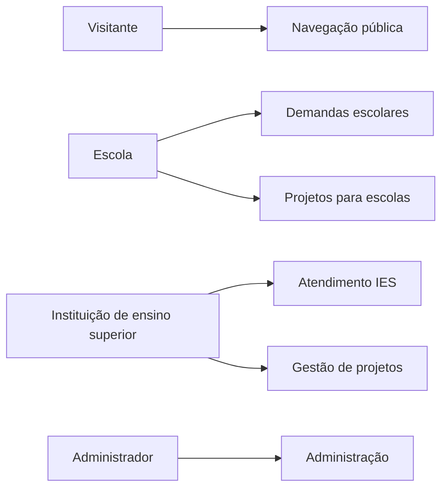
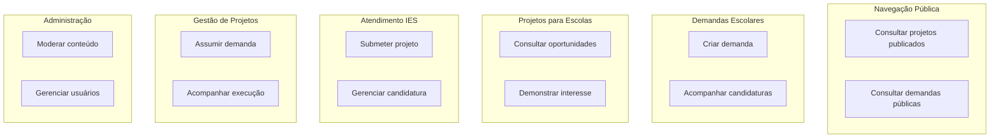

# Casos de uso

## Visão geral

```mermaid
flowchart LR
  Visitante --> Publico[Navegação pública]
  Escola --> Demandas[Demandas escolares]
  Escola --> Projetos[Projetos para escolas]
  IES[Instituição de ensino superior] --> Atendimento[Atendimento IES]
  IES --> Gestao[Gestão de projetos]
  Admin[Administrador] --> Administracao[Administração]
```

## Módulos e casos de uso

```mermaid
flowchart TB
  subgraph Publica[Navegação Pública]
    P1[Consultar projetos publicados]
    P2[Consultar demandas públicas]
  end
  subgraph Escolar[Demandas Escolares]
    E1[Criar demanda]
    E2[Acompanhar candidaturas]
  end
  subgraph Projetos[Projetos para Escolas]
    S1[Consultar oportunidades]
    S2[Demonstrar interesse]
  end
  subgraph IES[Atendimento IES]
    I1[Submeter projeto]
    I2[Gerenciar candidatura]
  end
  subgraph Gestao[Gestão de Projetos]
    G1[Assumir demanda]
    G2[Acompanhar execução]
  end
  subgraph Admin[Administração]
    A1[Moderar conteúdo]
    A2[Gerenciar usuários]
  end
```

Os nomes e os fluxos detalhados devem ser conferidos contra RF001–RF010 assim
que a fonte normativa for versionada.
