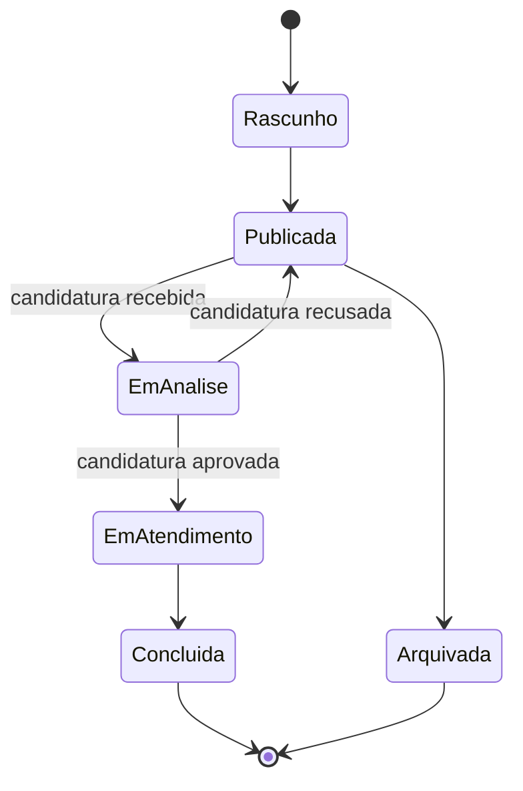
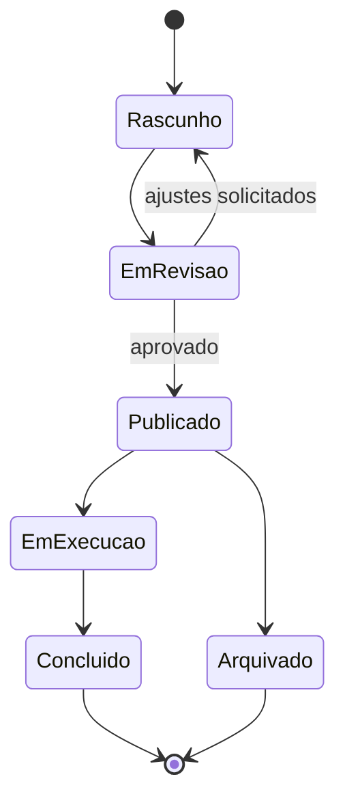

# Fluxos de estado

## Demanda

```mermaid
stateDiagram-v2
  [*] --> Rascunho
  Rascunho --> Publicada
  Publicada --> EmAnalise: candidatura recebida
  EmAnalise --> EmAtendimento: candidatura aprovada
  EmAnalise --> Publicada: candidatura recusada
  EmAtendimento --> Concluida
  Publicada --> Arquivada
  Concluida --> [*]
  Arquivada --> [*]
```

## Projeto

```mermaid
stateDiagram-v2
  [*] --> Rascunho
  Rascunho --> EmRevisao
  EmRevisao --> Publicado: aprovado
  EmRevisao --> Rascunho: ajustes solicitados
  Publicado --> EmExecucao
  EmExecucao --> Concluido
  Publicado --> Arquivado
  Concluido --> [*]
  Arquivado --> [*]
```
